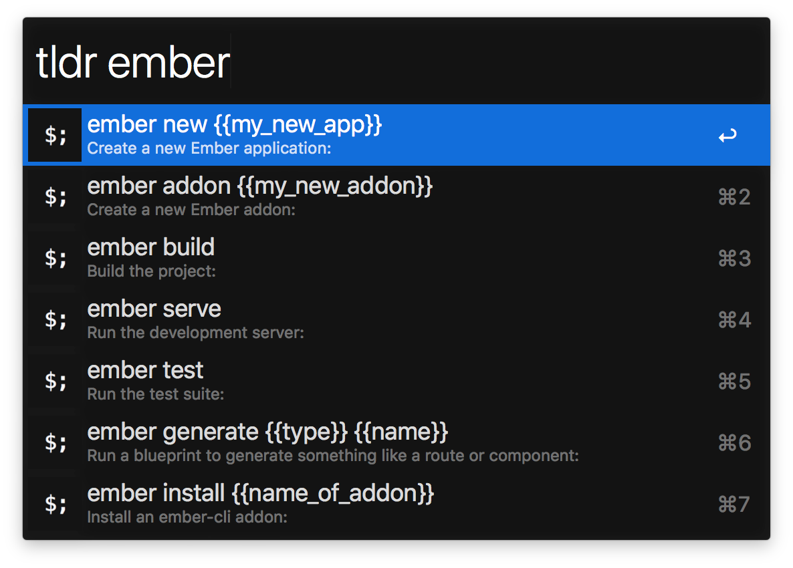

# @alexlafroscia/tldr-alfred-workflow [](https://travis-ci.org/alexlafroscia/tldr-alfred)

> Alfred workflow for TLDR docs



## Install

The workflow can be installed as a global NPM dependency. This makes it really easy to keep things up to date, since you can just upgrade to the latest version through NPM.

```bash
npm install --global @alexlafroscia/tldr-alfred-workflow
```

However, if you don't like global NPM packages, you can always clone the repo and install the dependencies; that will set up the workflow as well. The downside is that you'll need to keep the repo updated to the latest version manually, and install the dependencies again after each update.

```bash
git clone https://github.com/alexlafroscia/tldr-alfred.git
cd tldr-alfred
yarn install # Or `npm install` if you don't have yarn
```

*Requires [Node.js](https://nodejs.org) 8+ and the Alfred [Powerpack](https://www.alfredapp.com/powerpack/).*

## Usage

In Alfred, type `tldr` followed by the name of a command you want to search for, such as `man`.

Continue typing to filter the results by the contents of the code example.

### More Features

- Pressing `CMD-C` on a result will copy the code example to the keyboard
- Pressing `CMD-L` on any of the results will show the full Markdown description of the command
- Pressing `CMD-Y` on any of the results will show the TLDR webpage for the command in the Quicklook window

## FAQ

### Q: I'm getting an error about rate limiting? What's going on?

I noticed during development that after hitting their API repeatedly, Github started sending `403` responses. If you wait a bit, you should be able to make requests again.

## License

MIT © [Alex LaFroscia](https://github.com/alexlafroscia)
